*©2023 Axis Communications AB. AXIS COMMUNICATIONS, AXIS, ARTPEC and VAPIX are registered trademarks of Axis AB in various jurisdictions. All other trademarks are the property of their respective owners.*

<!-- omit from toc -->
# This tutorial has been archived, and its content moved to [Axis Developer Documentation](https://developer.axis.com/analytics/how-to-guides/visualize-axis-object-analytics-data-using-grafana-dashboard)

<!-- omit from toc -->
# AXIS Object Analytics visualization using Grafana® dashboard

<!-- omit from toc -->
## Table of contents

- [Overview](#overview)
- [Prerequisites](#prerequisites)
- [Provision AWS IoT Core and Things](#provision-aws-iot-core-and-things)
- [Connect the camera's MQTT client to AWS IoT Core](#connect-the-cameras-mqtt-client-to-aws-iot-core)
- [Configure AXIS Object Analytics to send MQTT messages](#configure-axis-object-analytics-to-send-mqtt-messages)
- [Provision Amazon Timestream](#provision-amazon-timestream)
- [Route messages from AWS IoT Core to Amazon Timestream](#route-messages-from-aws-iot-core-to-amazon-timestream)
- [Verify data in Amazon Timestream](#verify-data-in-amazon-timestream)
- [Connect Grafana to Amazon Timestream](#connect-grafana-to-amazon-timestream)
- [Grafana dashboard examples](#grafana-dashboard-examples)
    - [Example 1](#example-1)
    - [Example 2](#example-2)
    - [Inspirational dashboard](#inspirational-dashboard)
- [Disclaimer](#disclaimer)
- [License](#license)

## Overview

This tutorial shows you how to visualize data produced by a Crossline counting scenario, in [AXIS Object Analytics](https://www.axis.com/products/axis-object-analytics), on a [Grafana®](https://grafana.com/) dashboard.

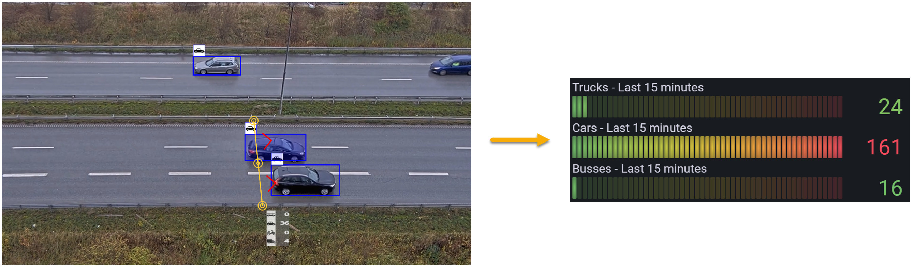\
*©2023 Axis Communications AB. All rights reserved.*\
*Screenshot from Grafana*

It uses MQTT as a secure transport protocol from the camera to AWS. [AWS IoT Core](https://aws.amazon.com/iot-core/) (MQTT broker) receives the MQTT messages from the camera and forwards them to a time-series database ([Amazon Timestream](https://aws.amazon.com/timestream/)) for storage and further processing. A local or cloud instance of Grafana is connected to the Amazon Timestream database, which queries the data and displays it visually in graphs and tables.

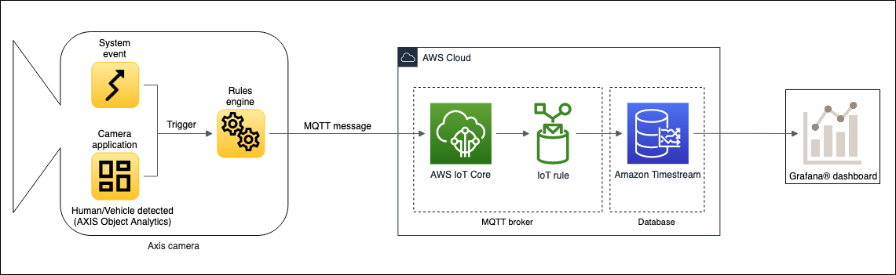

> **Note** Some sections can be replaced or changed to get a solution that fits other use-cases. For example, replace AXIS Object Analytics with some other analytics or triggers that send metadata to the AWS cloud. Or replace the Grafana visualization dashboard with some other data visualization platform.

## Prerequisites

- Axis camera running AXIS Object Analytics
- Access to AWS cloud services
- Local or cloud instance of Grafana

> **Note** The Amazon Timestream service isn't available in all regions. For this setup to work, select one of its [supported regions](https://docs.aws.amazon.com/general/latest/gr/timestream.html) for all AWS services used in this guide.
>
> Click [here](https://www.axis.com/products/axis-object-analytics#compatible-products) to see AXIS Object Analytics compatible cameras.

## Provision AWS IoT Core and Things

Provisioning an AWS IoT Core service provides an MQTT broker to which the Axis camera can connect:

1. Sign in to the [AWS Console](https://aws.amazon.com/console/) and search for **IoT Core**.
2. Go to **Manage** > **All devices** > **Things** and click **Create things**.
3. Select **Create single thing** and click **Next**.
4. Enter a unique name and click **Next**.
5. At the **Configure device certificate** page, select **Auto-generate a new certificate** and click **Next**.
6. Create a new or attach an existing policy to the certificate. You're redirected to a new page if you create a new policy. For this tutorial, create a new policy with two statements:
    - First statement
        - **Policy effect**: `Allow`
        - **Policy action**: `iot:Connect`
        - **Policy resource**: `*`
    - Second statement
        - **Policy effect**: `Allow`
        - **Policy action**: `iot:Publish`
        - **Policy resource**: `*`

    > **Warning** Not restricting the policy resource is acceptable in an exploratory phase, but applying [least-privilege permissions](https://docs.aws.amazon.com/IAM/latest/UserGuide/best-practices.html#grant-least-privilege) is a requirement before going to production.
7. Return to the previous page to attach the applicable policies and click **Create thing**.
8. Download the **Device certificate**, **Public key file**, **Private key file** and the **Root CA certificate**.

    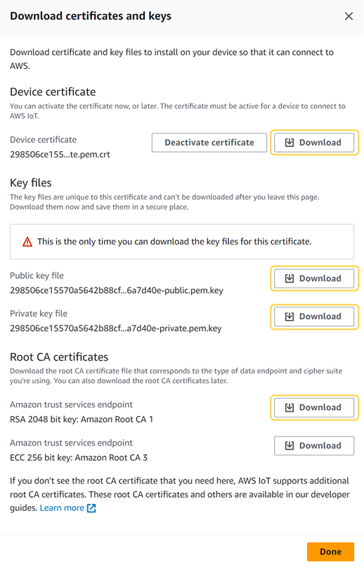\
    *Screenshot from AWS Console*

9. Click **Done**.

## Connect the camera's MQTT client to AWS IoT Core

First, install the client and CA certificates on the Axis camera to enable a secure MQTT connection to the AWS IoT Core MQTT broker:

1. Log in to the Axis camera and go to **System** > **Security**.
2. Click **Add certificate**.
3. Select **Upload a client-server certificate using a separate private key** and click **Next**.
4. Upload the client certificate (filename ends with `certificate.pem.crt`) and the private key (filename ends with `private.pem.key`) and click **Next**.
5. Click **Install** and then **Close**.
6. Click **Add certificate** again and select **Upload a CA certificate**.
7. Upload the root CA certificate (`AmazonRootCA1.pem`).
8. Click **Next** and then **Install**.

Next, configure the camera's MQTT client:

1. In the Axis camera go to **System** > **MQTT**.
2. In the **Host** field, enter the hostname for the IoT Core MQTT broker. You can find the hostname (endpoint) to the MQTT broker in the AWS Console under **IoT Core** > **Settings**.
3. In the **Protocol** drop-down menu, select **MQTT over SSL** using default port **8883**.
4. In the **Client certificate** field, select the previously uploaded client certificate.
5. In the **CA certificate** field, select the previously uploaded CA certificate.
6. Select **Validate server certificate**.
7. Click **Save**.
8. Turn on **Connect**.

Here' an example of an **MQTT client** setup in an Axis camera.

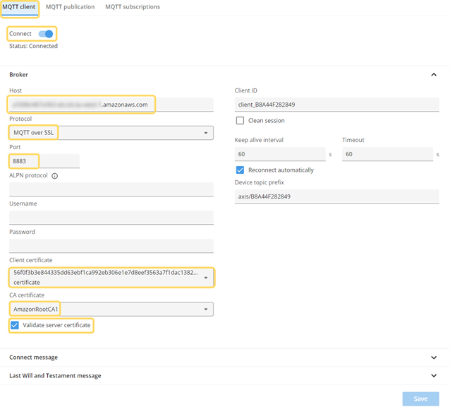\
*©2023 Axis Communications AB. All rights reserved.*

## Configure AXIS Object Analytics to send MQTT messages

1. In the camera, go to **Apps** and make sure that **AXIS Object Analytics** is running.
2. Open **AXIS Object Analytics** and click **New scenario**.
3. Enter a **Scenario name**
4. Select the objects to trigger on.
5. Select **Crossline counting** as the **Trigger condition**.
6. Configure the virtual line and trigger direction. See example below:

    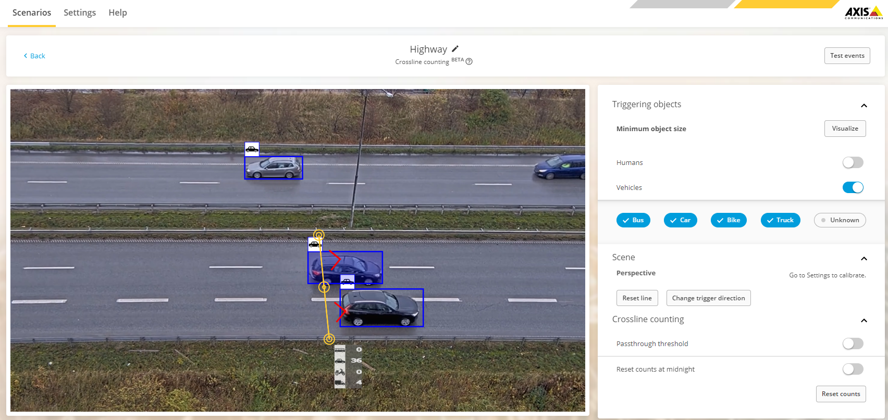\
    *©2023 Axis Communications AB. All rights reserved.*

7. Go to **System** > **MQTT** > **MQTT publication**.

    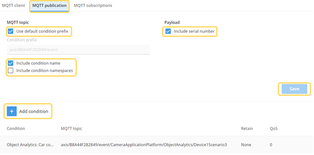\
    *©2023 Axis Communications AB. All rights reserved.*

8. Select **Use default condition prefix** to include the serial number in the MQTT topic, select **Include serial number** under **Payload**, **Include condition name** and make sure to unticked the **Include condition namespaces** in order to get a MQTT topic structure that can be handled by the AWS IoT Core rule, click **Save**.
9. Click **Add condition** and select the scenario created earlier in AXIS Object Analytics.
10. Click **Add** to save the changes.
11. Go to **IoT Core** in the AWS Console and make sure that the MQTT communication is working.
12. Go to **Test** > **MQTT test client**.
13. Enter `#` as **Topic filter** to see all incoming MQTT messages to the broker.
14. Click **Subscribe**. A new MQTT message is displayed every time an object passes the line configured in AXIS Object Analytics.

    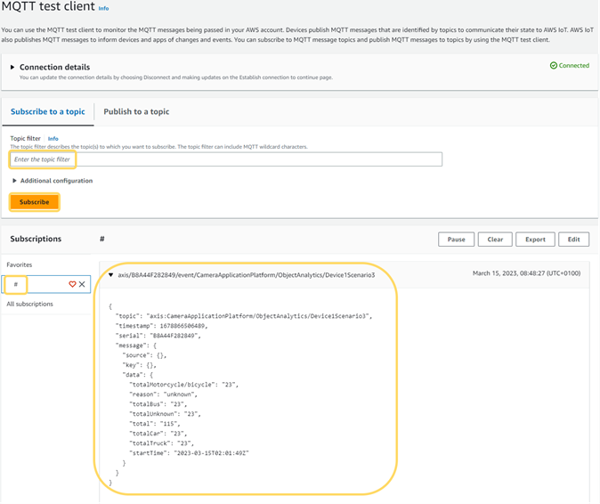\
    *Screenshot from AWS Console*

    An MQTT payload example of a message produced by a Crossline counting scenario can look like this.

    ```json
    {
        "topic": "axis:CameraApplicationPlatform/ObjectAnalytics/Device1Scenario1",
        "timestamp": 1670518346712,
        "serial": "0123456789AB",
        "message": {
            "source": {},
            "key": {},
            "data": {
                "startTime": "2022-12-06T22:01:25Z",
                "reason": "car",
                "total": "20960",
                "totalBus": "0",
                "totalCar": "18103",
                "totalHuman": "0",
                "totalMotorcycle/bicycle": "0",
                "totalTruck": "2857",
                "totalUnknown": "0"
            }
        }
    }
    ```

    In case there aren’t any objects passing the line while testing, you can click **Test events** to manually trigger events in AXIS Object Analytics.

    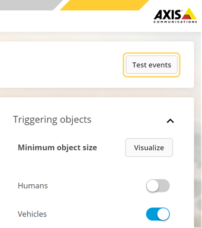\
    *©2023 Axis Communications AB. All rights reserved.*

## Provision Amazon Timestream

1. In the AWS Console, search for the **Amazon Timestream** service.
2. Click **Create database**.
3. Select **Standard database** and enter a name for the database.
4. Click **Create database**.
5. Go to **Tables** and click **Create table**.
6. Set a data retention time for both memory and magnetic storage. For more information See [AWS documentation](https://docs.aws.amazon.com/timestream/latest/developerguide/storage.html).

    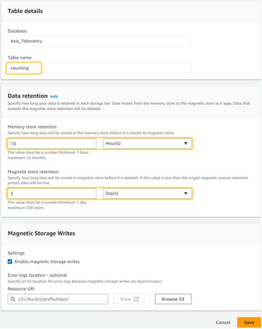\
    *Screenshot from AWS Console*

## Route messages from AWS IoT Core to Amazon Timestream

1. Access **IoT Core** in the AWS Console.
2. Go to **Manage** > **Message routing** > **Rules**.
3. Click **Create rule**.
4. Enter a **Rule name** and click **Next**.
5. On the **Configure SQL statement** page, enter the following SQL statement:

    ```sql
    SELECT message.data.reason
    FROM 'axis/+/event/CameraApplicationPlatform/ObjectAnalytics/#'
    ```

    The statement selects the `reason` measurement found in the MQTT payload, sent by AXIS Object Analytics using the MQTT topic `axis/0123456789AB/event/CameraApplicationPlatform/ObjectAnalytics/Device1Scenario1`.

    ```json
    {
        "topic":"axis:CameraApplicationPlatform/ObjectAnalytics/Device1Scenario1",
        "timestamp": 1670519332535,
        "serial": "0123456789AB",
        "message": {
            "source": {},
            "key": {},
            "data": {
                "startTime": "2022-12-06T22:01:25Z",
                "reason": "car",
                "total": "21093",
                "totalBus": "0",
                "totalCar": "18222",
                "totalHuman": "0",
                "totalMotorcycle/bicycle": "0",
                "totalTruck": "2871",
                "totalUnknown": "0"
            }
        }
    }
    ```

    > **Note** The MQTT topic wildcards `+` and `#` are used in the SQL statement.
    >
    > `+` matches any character between the two slashes `/+/`. Use the wildcard `+` instead of explicitly stating the MAC address to allow all cameras to route their data to the database.
    >
    > `#` at the end of the statement matches any character, including `/`. This means that the statement will match any topic structure after `/ObjectAnalytics/`. This will allow all AXIS Object Analytics scenarios to route their data to the database.

    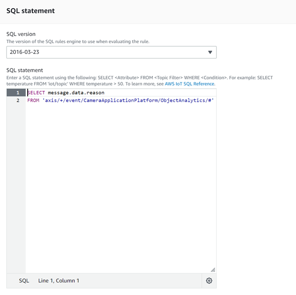\
    *Screenshot from AWS Console*

6. Click **Next**.
7. On the **Attach rule actions** page, select **Timestream table** as **Action 1**.
8. Select the database and the table.
9. Enter a name in the **Dimensions name** field.
10. Set the **Dimension value** to `${serial}`, which in this case represents the MAC address of the camera.
11. Add a new dimension and set a **Dimension name** and the **Dimension value** to `${topic}`, which in this case represents a unique scenario in the AXIS Object Analytics application.
12. Under **IAM role**, click **Create new role** and enter a **Role name**. This automatically generates an IAM role.
    > **Note** For the MQTT messages to be stored in the database, it is necessary to grant the IoT Core service access to the Amazon Timestream service.

    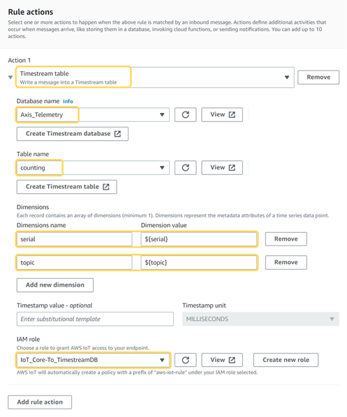\
    *Screenshot from AWS Console*

13. Click **Next**.
14. Verify that all the information is correct and click **Create**.

## Verify data in Amazon Timestream

1. Access **Amazon Timestream** in the AWS Console.
2. Go to **Management Tools** > **Query editor**.
3. Enter the following query to list the 10 most recently added data points:

    ```sql
    SELECT *
    FROM <database>.<table>
    ORDER BY time DESC
    LIMIT 10
    ```

    `<database>` is the name of your database and `<table>` is the name of your table.

    > **Note** If the name of your database or table contains special characters, you may need to encapsulate the name in quotation marks. For example, if the database is named `my-database` and the table is named `my-table`, the table reference is `"my-database"."my-table"`.

4. Click **Run** to execute the query.

    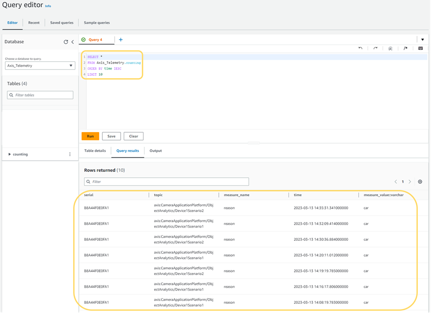\
    *Screenshot from AWS Console*

## Connect Grafana to Amazon Timestream

There are several ways of provisioning a Grafana instance, depending on your domain expertise or existing environments. We won't provide you with provisioning instructions. Instead, we'll give you a few different options:

- [Pull and run](https://hub.docker.com/r/grafana/grafana) a self-managed Grafana Docker image
- [Download and install](https://grafana.com/get/?tab=self-managed) a self-managed Grafana instance
- Provision a managed instance on [Grafana Cloud](https://grafana.com/grafana/)
- Provision an [Amazon Managed Grafana](https://aws.amazon.com/grafana/)

With a running Grafana instance, complete the following steps to build a dashboard:

1. In Grafana, go to **Configuration** > **Plugins**.
2. Search for the **Amazon Timestream** plugin and click **Install**.
3. Once the plugin is installed, click **Create a Amazon Timestream data source**.
4. In AWS console, Access the **IAM** service to setup a user with the correct permissions and policy. This is done to handle the authentication from Grafana to Amazon Timestream.
5. Go to **Access management** > **Users** and click **Add users**.
6. Enter a name and click **Next**.
7. On the **Set permissions** page, select the **Attach policies directly** option and search for the **AmazonTimestreamReadOnlyAccess** policy name. Select it and click **Next**.
8. Make sure the information is correct and then click **Create user**.
9. Select the created user and go to the **Security credentials** tab.
10. Scroll down to **Access keys** and click **Create access key**.
11. Select the **Third-party service** option and click **Next**.
12. Click **Create access key**. Take note of the **Access key** and **Secret access key** as these credentials are required when establishing the connection from Grafana to Amazon Timestream.
13. In Grafana, select **Access & secret key** as **Authentication Provider**, and enter **Access Key ID** and **Secret Access Key**.
14. In the **Default Region** field, enter the region in which you created your Amazon Timestream database.
    > **Note** A region is defined by its ID, but it also has a more descriptive name. For example, the region with ID `us-east-1` corresponds to `North Virginia`. If you're not sure which region to select, go to your Amazon Timestream database and in its summary in the AWS Console, and look at the **Database ARN**. The format of the ARN is `arn:aws:timestream:<region>:<account>:database/<database>`.
15. With the default regions selected, you can now select **Database**, **Table**, and **Measure**, all of which have been configured in AWS.
16. Click **Save and test** to verify that the connection has been established.

    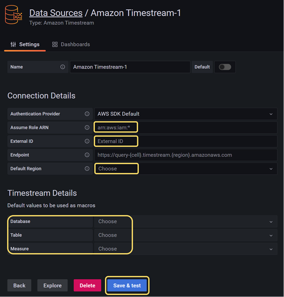\
    *Screenshot from Grafana*

17. Once Grafana and Amazon Timestream are connected, click **Dashboards** > **New Dashboard**.
18. Add a new panel.
19. In the **Data source** field, select `Amazon Timestream` and then ensure that the appropriate **Database**, **Table**, and **Measure** values are selected.
20. Enter an SQL query to visualize the data stored in Amazon Timestream. Refer to the [examples](#grafana-dashboard-examples) for queries that can provide insights using graphical representations of the data.

## Grafana dashboard examples

Below are some SQL queries that you can use to visualize the object counting data produced by AXIS Object Analytics.

### Example 1

Count the number of cars in the time range selected for the current dashboard. Aggregated counts in 1-hour sections.

```sql
SELECT count(*) AS Cars, BIN(time, 1h) AS bin_time
FROM $__database.$__table
WHERE measure_value::varchar = 'car' AND topic = 'axis:CameraApplicationPlatform/ObjectAnalytics/Device1Scenario1' AND serial = '0123456789AB'
GROUP BY BIN(time, 1h)
ORDER BY bin_time
```

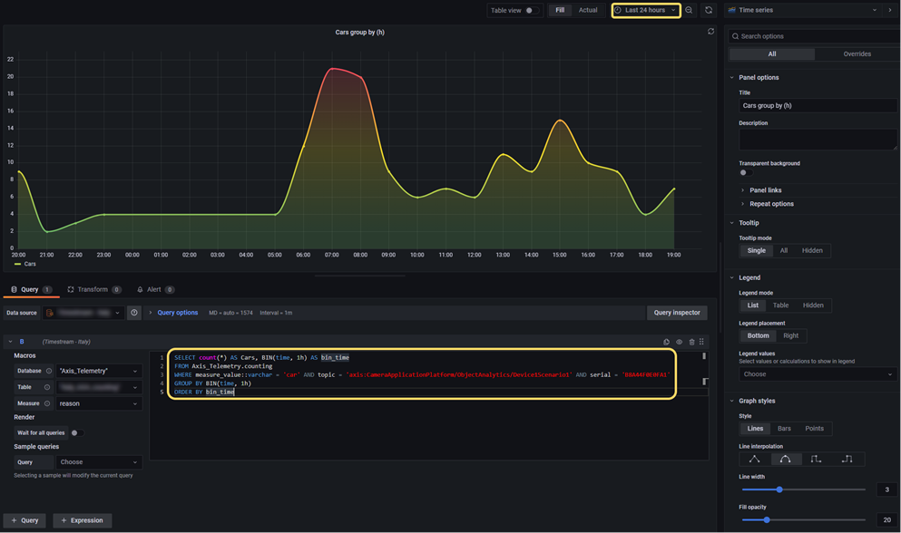\
*Screenshot from Grafana*

### Example 2

Count the number of cars in fixed time ranges such as the last hour, the last day, or the 7 days.

```sql
SELECT count(*) AS "Last hour"
FROM $__database.$__table
WHERE measure_value::varchar = 'car' AND time between ago(1h) and now() AND topic = 'axis:CameraApplicationPlatform/ObjectAnalytics/Device1Scenario1' AND serial = '0123456789AB'
```

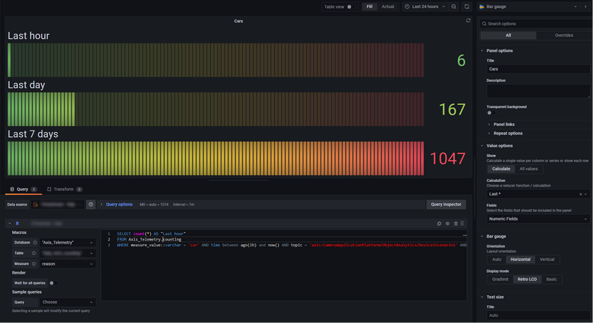\
*Screenshot from Grafana*

### Inspirational dashboard

Below dashboard shows different panels where several object detections by AXIS Object Analytics are represented. E.g. Humans, Cars and Motorcycles/Bicycles in defined directions.

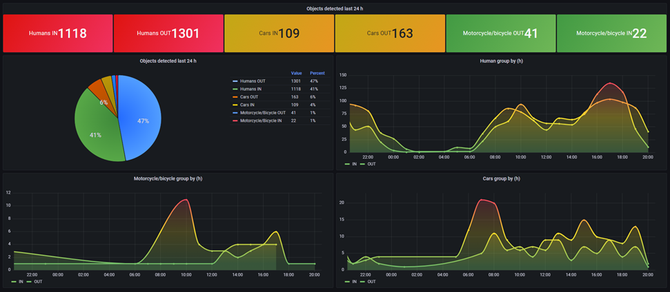\
*Screenshot from Grafana*

## Disclaimer

<!-- textlint-disable -->

This document and its content are provided courtesy of Axis and all rights to the document shall remain vested in Axis Communications AB. AXIS COMMUNICATIONS, AXIS, ARTPEC and VAPIX are registered trademarks of Axis AB in various jurisdictions. The Grafana Labs Marks are trademarks of Grafana Labs, and are used with Grafana Labs’ permission. We are not affiliated with, endorsed or sponsored by Grafana Labs or its affiliates. Amazon Web Services, AWS and the Powered by AWS logo are trademarks of Amazon.com, Inc. or its affiliates. Docker and the Docker logo are trademarks or registered trademarks of Docker, Inc. in the United States and/or other countries. Docker, Inc. and other parties may also have trademark rights in other terms used herein. All other trademarks are the property of their respective owners, and we are not affiliated with, endorsed or sponsored by them or their affiliates.

As described in this document, you may be able to connect to, access and use third party products, web sites, example code, software or services (“Third Party Services”). You acknowledge that any such connection and access to such Third Party Services are made available to you for convenience only. Axis does not endorse any Third Party Services, nor does Axis make any representations or provide any warranties whatsoever with respect to any Third Party Services, and Axis specifically disclaims any liability or obligations with regard to Third Party Services. The Third Party Services are provided to you in accordance with their respective terms and conditions, and you alone are responsible for ensuring that you (a) procure appropriate rights to access and use any such Third Party Services and (b) comply with the terms and conditions applicable to its use.

PLEASE BE ADVISED THAT THIS DOCUMENT IS PROVIDED “AS IS” WITHOUT WARRANTY OF ANY KIND, AND IS NOT INTENDED TO, AND SHALL NOT, CREATE ANY LEGAL OBLIGATION FOR AXIS COMMUNICATIONS AB AND/OR ANY OF ITS AFFILIATES. THE ENTIRE RISK AS TO THE USE, RESULTS AND PERFORMANCE OF THIS DOCUMENT AND ANY THIRD PARTY SERVICES REFERENCED HEREIN IS ASSUMED BY THE USER OF THE DOCUMENT AND AXIS DISCLAIMS AND EXCLUDES, TO THE MAXIMUM EXTENT PERMITTED BY LAW, ALL WARRANTIES, WHETHER STATUTORY, EXPRESS OR IMPLIED, INCLUDING BUT NOT LIMITED TO ANY IMPLIED WARRANTIES OF MERCHANTABILITY, FITNESS FOR A PARTICULAR PURPOSE, TITLE AND NON-INFRINGEMENT AND PRODUCT LIABILITY.

<!-- textlint-enable -->

## License

Example Code means the examples provided by Axis in this document within the grey text boxes.

Example Code ©2023 Axis Communications AB is licensed under the [Apache License, Version 2.0 (the “License”)](./LICENSE). You may not use the Example Code except in compliance with the License.

You may obtain a copy of the License at <https://www.apache.org/licenses/LICENSE-2.0>. Example Code distributed under the License is distributed on an “AS IS” BASIS, WITHOUT WARRANTIES OR CONDITIONS OF ANY KIND, either express or implied. See the License for the specific language governing permissions and limitations under the License.
